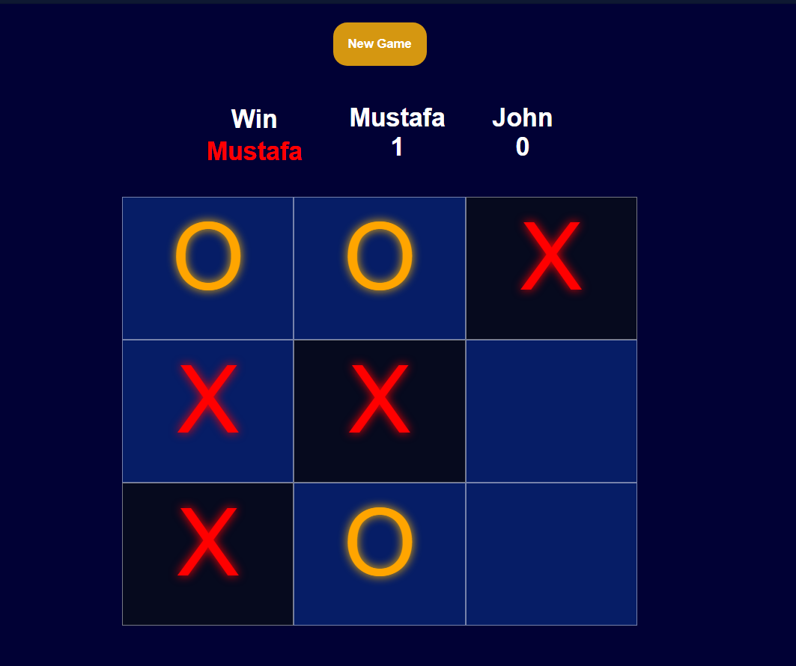

# ✨ Tic-Tac-Toe (Responsive Web Game)

A modern, interactive, and fully responsive Tic-Tac-Toe game built with vanilla JavaScript, HTML, and CSS. Enjoy smooth animations, sound effects, score tracking, and a beautiful UI—playable on any device!

---

## 🎮 Features

- **Responsive Design:**  
  The gameboard adapts seamlessly to desktops, tablets, and mobile screens.
- **Animated Moves:**  
  Each move appears with a smooth scale and fade-in transition.
- **Sound Effects:**  
  Enjoy satisfying sounds for moves, wins, and resets.
- **Score Tracking:**  
  Player scores persist across rounds for competitive play.
- **Winning Highlight:**  
  Winning cells are visually highlighted for clarity and excitement.
- **Custom Player Names:**  
  Enter your names before starting for a personalized experience.
- **Accessible Controls:**  
  Large clickable areas and clear turn indicators.

---

## 🖼️ Screenshots

  

---

## 🚀 Getting Started

1. **Clone or Download** this repository.
2. Open `index.html` in your browser.
3. Enter player names and start playing!

---

## 🛠️ Tech Stack

- **HTML5**
- **CSS3** (Grid, transitions, responsive units)
- **JavaScript (ES6+)**

---

## 📁 Project Structure

```
Tic-Tac-Toe/
│
├── index.html
├── style.css
├── script.js
└── audio/
    ├── pop.mp3
    ├── win.mp3
    └── swoosh.mp3
```

---

## 💡 How It Works

- **Gameboard:**  
  3x3 grid using CSS Grid. Each cell is clickable and animated.
- **Transitions:**  
  Moves scale and fade in using CSS transitions for a polished feel.
- **Sound:**  
  Audio feedback for moves, wins, and resets (see `/audio` folder).
- **Win Detection:**  
  All classic Tic-Tac-Toe win conditions are checked after each move.
- **Highlight:**  
  Winning cells are highlighted with a color overlay.
- **Reset:**  
  Start a new game anytime with the "New Game" button.

---

## 👨‍💻 Author

Ghulam Mustafa Bhatti

---

## 📜 License

This project is open for educational and personal use.

---

Enjoy playing, and feel free